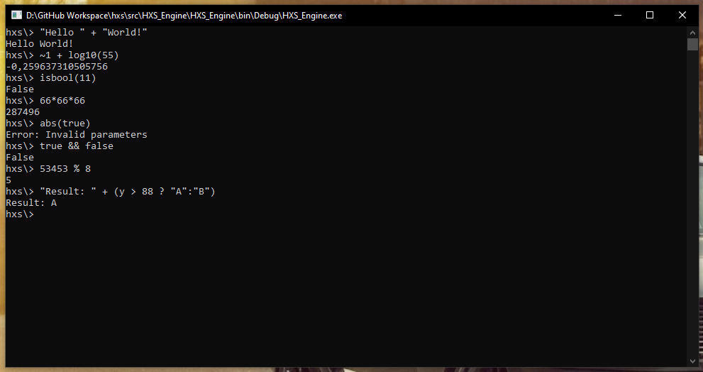

# HXS
HXS can parse and execute  simple code expressions. It can be easily integrated in other tools. HXS does not require any NuGet packages. The code was written in 2014 as part of a personal project.



## Examples
```
hxs\> "Result: " + (y > 88 ? "A":"B")
Result: A
```
> `y` is set to `100` in this example.

```
hxs\> 5 % 2
1
```
```
hxs\> !true
False
```
```
hxs\> !false
True
```
```
hxs\> true && false || true
True
```
```
hxs\> true && false || false
False
```
```
hxs\> 4 > 3
True
```
```
hxs\> 1 + 1
2
```
```
hxs\> 55 >> 2
13
```
```
hxs\> ~1
-2
```
```
hxs\> ~1 + log10(55)
-0,259637310505756
```
```
hxs\> 2 + 5 * 5
27
```
```
hxs\> true XOR true
False
```
```
hxs\> abs(-553)
553
```
```
hxs\> tan(44)
0,0177046992786858
```
```
hxs\> isbool(11)
False
```
```
hxs\> pow(2, 8)
256
```
```
hxs\> floor(4.88)
4
```